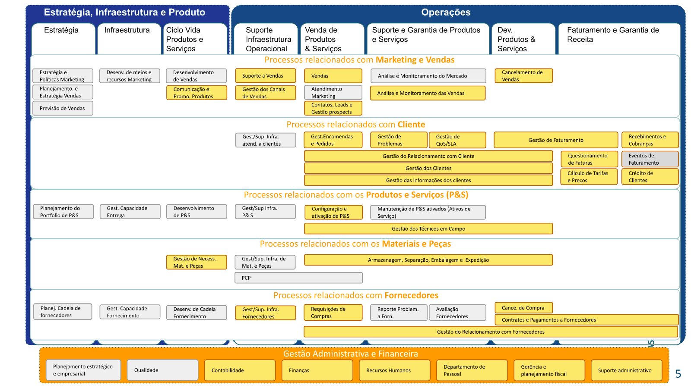

# Nasajon ERP 4.0 - Documentação das APIs

## Introdução

A sigla ERP (do inglês "Enterprise Resource Planning"), pode ser traduzida como "Sistema Integrado de Gestão Empresarial", e designa sistemas, de variadas envergaduras, que visão centralizar os dados e processos das diversas frentes de atuação de uma empresa cliente.

Na prática, os ERPs se dividem entre sistemas especialistas (focados numa única área de processos empresariais), e sistemas de aplicação ampla (virtualmente capazes de suportar todas as áreas comuns aos mais diversos tipos de organizações).

O ERP Nasajon se enquadra no contexto dos sistemas de aplicação ampla, mas, diferentemente de seus concorrentes, não é focado apenas na simples concentração dos dados, mas principalmente na automação dos processos empresariais.

Neste documento serão apresentadas as mais diversas APIs de integração com o ERP Nasajon 4.0.

Obs.: Além da documentação dos processos cobertos pelo ERP Nasajon, e suas respectivas APIs (introduzidas a seguir), sugere-se consultar a página de [Disposições Gerais](disposicoes-gerais.md) das APIs do ERP Nasajon (para tomar ciência dos padrões que regem as APIs como um todo).

## A Matriz de Operações e Processos Empresariais (MOPE)

A MOPE, é uma iniciativa da Nasajon, criada com o fim de simplificar a descrição dos processos contidos no escopo de seu ERP.

Em se tratando de um ERP de aplicação ampla, a simples listagem de todos os processos (módulos, rotas, etc) suportados pelo ERP Nasajon, resultaria num esforço demasiado tedioso para o leitor.

Pensando nisso, a Nasajon desenvolveu um formato proprietário de indexação dos processos suportados por seus produtos, denominado "MOPE".

A MOPE, por sua vez, herda seus conceitos do internacionalmente reconhecido [framework eTom](https://en.wikipedia.org/wiki/Business_Process_Framework_(eTOM)), o qual é amplamente difundido na área de Telecomunicações. A MOPE porém pode ser descrita como uma adaptação conceitual do eTom, destinada à representação matricial dos processos suportados e planejados, para o ERP Nasajon.

Como já dito, se uma empresa genérica apresenta áreas de processo comuns como: contas a pagar, contabilidade, contas a receber, gestão de recursos humanos, etc. A MOPE simplemente mapeia esses processos em áreas, e os indexa numa matriz, onde:

* **Linhas:** Representam as grandes áreas dos processos de uma empresa.
* **Colunas:** Representam as grandes áreas de operação de uma empresa.
* **Células:** Representam os processos propriamente ditos.

Assim, navegando pela MOPE é possível alcançar qualquer área empresarial suportada pelo ERP. E, de igual modo, a própria indexação das APIs do ERP Nasajon também realizada por meio da MOPE.

Portanto, escolha o processo desejado na imagem da MOPE, e clique num dos links da árvore correspondente abaixo da MOPE, para acessar as APIs do processo desejado:

* 1 - Processos relacionados com Marketing e Vendas
* 2 - Processos relacionados com o Cliente
* 3 - Processos relacionados a Produtos e Serviços
* 4 - Processos relacionados com Materiais e Peças
  * 43 - Ciclo de Vidas de Produtos e Serviços
    * [431 - Gestão das Necessidades de Peças e Materiais](processos/431/README.md)
  * 44 - Suporte a Vendas
  * 45 - Venda de Produtos e Serviços
* 5 - Processos relacionados a Fornecedores
* 6 - Gestão Administrativa e Financeira